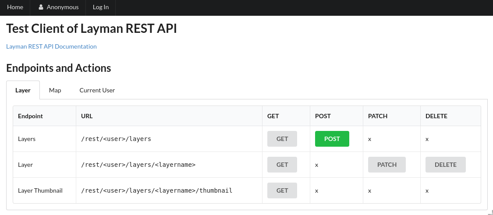

# Configure Authentication and Authorization

## Stop Layman
```bash
# 1. go to layman's directory
$ cd ~/layman

# 2. stop Layman
$ make stop-demo
docker-compose -f docker-compose.deps.demo.yml -f docker-compose.demo.yml stop
WARNING: The UID_GID variable is not set. Defaulting to a blank string.
Stopping layman_nginx_1         ... done
Stopping flower                 ... done
Stopping layman_celery_worker_1 ... done
Stopping layman                 ... done
Stopping micka                  ... done
Stopping layman_geoserver_1     ... done
Stopping layman_client          ... done
Stopping hslayers               ... done
Stopping layman_redis_1         ... done
Stopping layman_postgresql_1    ... done
```

## Change configuration

```bash
# 1. edit configuration nano tool
$ nano .env
```

1. Find following two lines
    ```
    LAYMAN_AUTHN_MODULES=
    LAYMAN_AUTHZ_MODULE=layman.authz.read_everyone_write_everyone
    ```
    and replace them with
    ```
    LAYMAN_AUTHN_MODULES=layman.authn.oauth2
    LAYMAN_AUTHN_OAUTH2_PROVIDERS=layman.authn.oauth2.liferay
    LAYMAN_AUTHZ_MODULE=layman.authz.read_everyone_write_owner
    ```
2. Insert following lines at the end of file and replace `<your IP address>` with your IP address.
    ```bash
    OAUTH2_LIFERAY_CLIENT_ID=id-353ab09c-f117-f2d5-d3a3-85cfb89e6746
    OAUTH2_LIFERAY_SECRET=secret-d31a82c8-3e73-1058-e38a-f9191f7c2014
    OAUTH2_LIFERAY_AUTH_URL=http://167.172.174.152:8082/o/oauth2/authorize
    OAUTH2_LIFERAY_TOKEN_URL=http://167.172.174.152:8082/o/oauth2/token
    OAUTH2_LIFERAY_CALLBACK_URL=http://<your IP address>/client/authn/oauth2-liferay/callback
    OAUTH2_LIFERAY_INTROSPECTION_URL=http://167.172.174.152:8082/o/oauth2/introspect
    OAUTH2_LIFERAY_USER_PROFILE_URL=http://167.172.174.152:8082/api/jsonws/user/get-current-user
    ```

Press `Ctrl+O` to save file, confirm with pressing `Enter`, and then `Ctrl+X` to exit nano.

## Rebuild Layman

```bash
$ make build-demo
docker-compose -f docker-compose.deps.demo.yml -f docker-compose.demo.yml build layman layman_client geoserver hslayers
...
Successfully built fbafaabc8386
Successfully tagged layman:latest
```

## Start Layman
```bash
# 1. start dockerized containers in background
$ make start-demo-full-d
docker-compose -f docker-compose.deps.demo.yml -f docker-compose.demo.yml up -d --force-recreate postgresql geoserver redis layman celery_worker flower hslayers layman_client micka nginx
...
Creating hslayers            ... done
Creating layman_postgresql_1 ... done
Creating layman_redis_1      ... done
Creating layman_geoserver_1  ... done
Creating micka               ... done
Creating layman_client       ... done
Creating layman              ... done
Creating layman_celery_worker_1 ... done
Creating flower                 ... done
Creating layman_nginx_1         ... done

# 2. check layman container
$ docker logs layman
...
[2020-01-28 14:57:20 +0000] [1] [INFO] Starting gunicorn 19.9.0
[2020-01-28 14:57:20 +0000] [1] [INFO] Listening at: http://0.0.0.0:8000 (1)
[2020-01-28 14:57:20 +0000] [1] [INFO] Using worker: sync
[2020-01-28 14:57:20 +0000] [12] [INFO] Booting worker with pid: 12
[2020-01-28 14:57:20 +0000] [13] [INFO] Booting worker with pid: 13
```

Then visit `http://<your IP address>` in your web browser. You should see simple web client, this time with **Log In** option in header menu.



