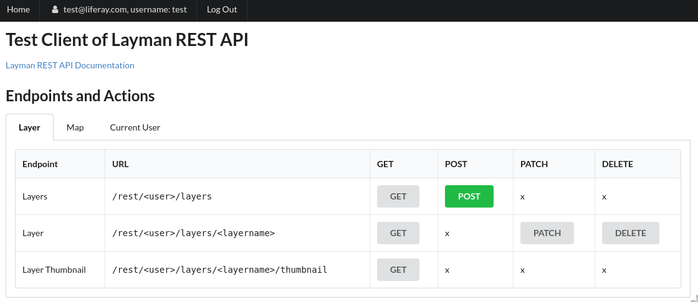

# Layman Workshop

We will work on remote machines with Linux operating system during the workshop to ensure suitable and consistent environment.

## Preconditions
It's recommended to bring
- Your own laptop with SSH client
   - Linux users: You are probably OK, SSH client is installed on most distributions. Just try `ssh` command in your terminal.
   - Windows users: Install [PuTTy](https://www.putty.org/).

- Pair of public and private OpenSSH-compatible SSH Keys (RSA keys)

   Your public key will be uploaded to remote machine at the beginning of the workshop, so you connect to the remote machine using SSH protocol. Sure you can use your existing keys, if you already have it.

   - Linux users: see [Step 1 — Create the RSA Key Pair](https://www.digitalocean.com/community/tutorials/how-to-set-up-ssh-keys-on-ubuntu-1804#step-1-—-create-the-rsa-key-pair)
   - Windows users: Install [PuTTYgen](https://www.putty.org/) and see ["Generating OpenSSH-compatible Keys for Use with PuTTY"](https://www.digitalocean.com/community/tutorials/how-to-create-ssh-keys-with-putty-to-connect-to-a-vps#generating-openssh-compatible-keys-for-use-with-putty)

Knowledge of [basic bash commands](http://cheatsheetworld.com/programming/unix-linux-cheat-sheet/) is a plus, but not necessary.


## Connect to your remote machine
Each user works on his own remote machine with custom IP address.

Linux users:
```bash
# to use your default SSH key located at ~/.ssh/id_rsa
$ ssh root@<your IP address>

# or to use some other SSH key
$ ssh -i path/to/private_ssh_key_file root@<your IP address>
```

Windows users: See [Create a PuTTY Profile to Save Your Server's Settings](https://www.digitalocean.com/community/tutorials/how-to-create-ssh-keys-with-putty-to-connect-to-a-vps#create-a-putty-profile-to-save-your-server's-settings)

```bash
# during first connection, you will probably see something like
The authenticity of host '<your IP address> (<your IP address>)' can't be established.
ECDSA key fingerprint is SHA256:GYQD7ChIQrO9M2CkmW5kpEde0t3L3WjU/KjdsToblcE.
Are you sure you want to continue connecting (yes/no)?

# answer 'yes'
$ yes
```

Let's check operating system:
```bash
$ cat /etc/os-release
NAME="CentOS Linux"
VERSION="7 (Core)"
ID="centos"
ID_LIKE="rhel fedora"
VERSION_ID="7"
PRETTY_NAME="CentOS Linux 7 (Core)"
ANSI_COLOR="0;31"
CPE_NAME="cpe:/o:centos:centos:7"
HOME_URL="https://www.centos.org/"
BUG_REPORT_URL="https://bugs.centos.org/"

CENTOS_MANTISBT_PROJECT="CentOS-7"
CENTOS_MANTISBT_PROJECT_VERSION="7"
REDHAT_SUPPORT_PRODUCT="centos"
REDHAT_SUPPORT_PRODUCT_VERSION="7"
```

## Install prerequisites
We will run Layman using docker and docker-compose that is suitable for demonstration purposes. Running in production is [different story](https://github.com/jirik/layman#run-in-production).

### docker
```bash
# 1. install docker prerequisities
$ yum install -y yum-utils device-mapper-persistent-data lvm2
...
Complete!

# 2. add repository with docker package
$ yum-config-manager --add-repo https://download.docker.com/linux/centos/docker-ce.repo
adding repo from: https://download.docker.com/linux/centos/docker-ce.repo
grabbing file https://download.docker.com/linux/centos/docker-ce.repo to /etc/yum.repos.d/docker-ce.repo
repo saved to /etc/yum.repos.d/docker-ce.rep

# 3. install docker
$ yum install -y docker-ce docker-ce-cli
...
Complete!

# 4. start docker service
$ systemctl start docker

# 5. check docker version
$ docker -v
Docker version 19.03.5, build 633a0ea

# 6. verify docker's installation by running hello-world image
$ docker run hello-world
Unable to find image 'hello-world:latest' locally
latest: Pulling from library/hello-world
1b930d010525: Pull complete 
Digest: sha256:9572f7cdcee8591948c2963463447a53466950b3fc15a247fcad1917ca215a2f
Status: Downloaded newer image for hello-world:latest

Hello from Docker!
...
```

### docker-compose
```bash
# 1. download docker-compose
$ curl -L "https://github.com/docker/compose/releases/download/1.23.2/docker-compose-$(uname -s)-$(uname -m)" -o /usr/local/bin/docker-compose
...

# 2. make it executable
$ chmod +x /usr/local/bin/docker-compose

# 3. check docker-compose version
$ docker-compose --version
docker-compose version 1.23.2, build 1110ad01
```

### Other
```bash
# 1. install other tools
$ yum install -y git nano
...
Complete!
```

## Install Layman

### Download

```bash
# 1. go to your home directory
$ cd

# 2. download layman
$ git clone https://github.com/jirik/layman.git
...

# 3. enter layman's directory
$ cd layman

# 4. choose specific layman version
$ git checkout 039d8a6
...
HEAD is now at 039d8a6... Add 'about' documentation in EN and CS

```

### Basic configuration

```bash
# 1. create .env configuration file
$ cp .env.demo .env

# 2. edit it using nano tool
$ nano .env
```

Find following three lines and replace `localhost` in them with your IP address
```
LAYMAN_PROXY_SERVER_NAME=localhost
LAYMAN_CLIENT_PUBLIC_URL=http://localhost/client/
CSW_RECORD_URL=http://localhost:3080/record/basic/{identifier}
```
e.g.
```
LAYMAN_PROXY_SERVER_NAME=123.124.125.126
LAYMAN_CLIENT_PUBLIC_URL=http://123.124.125.126/client/
CSW_RECORD_URL=http://123.124.125.126:3080/record/basic/{identifier}
```

Press `Ctrl+O` to save file, confirm with pressing `Enter`, and then `Ctrl+X` to exit nano.

### Prepare GeoServer
```bash
# 1. download geoserver and prepare its data directory
$ make geoserver-reset-default-layman-datadir
docker-compose -f docker-compose.deps.yml run --rm --no-deps geoserver bash /geoserver_code/reset-default-layman-datadir.sh
...
Successfully built abba31808665
Successfully tagged layman_geoserver:latest
WARNING: Image for service geoserver was built because it did not already exist. To rebuild this image you must use `docker-compose build` or `docker-compose up --build`.

# 2. check that data directory with layman user was created
$ cat deps/geoserver/data/security/usergroup/default/users.xml
<userRegistry version="1.0" xmlns="http://www.geoserver.org/security/users">
    <users>
        <user enabled="true" name="admin" password="digest1:D9miJH/hVgfxZJscMafEtbtliG0ROxhLfsznyWfG38X2pda2JOSV4POi55PQI4tw"/>
        <user enabled="true" name="layman" password="plain:laymanpwd"/>
        <user enabled="true" name="layman_test" password="plain:laymanpwd"/>
    </users>
    <groups/>
</userRegistry>
```

### Start Layman
```bash
# 1. start dockerized containers in background
$ make start-demo-full-d
docker-compose -f docker-compose.deps.demo.yml -f docker-compose.demo.yml up -d --force-recreate postgresql geoserver redis layman celery_worker flower hslayers layman_client micka nginx
...
# takes about 5 minutes
Creating hslayers            ... done
Creating layman_postgresql_1 ... done
Creating layman_redis_1      ... done
Creating layman_geoserver_1  ... done
Creating micka               ... done
Creating layman_client       ... done
Creating layman              ... done
Creating layman_celery_worker_1 ... done
Creating flower                 ... done
Creating layman_nginx_1         ... done

# 2. check running containers
$ docker ps
2406a488d565        nginx:1.16-alpine                    "nginx -g 'daemon of…"   26 seconds ago      Up 25 seconds       0.0.0.0:80->80/tcp     layman_nginx_1
d5c0e71c069b        layman:latest                        "bash -c 'cd src && …"   27 seconds ago      Up 26 seconds                              flower
80a1dd7acfd6        layman:latest                        "bash -c 'cd src && …"   28 seconds ago      Up 27 seconds                              layman_celery_worker_1
2256222206a9        layman:latest                        "bash -c 'python3 sr…"   28 seconds ago      Up 28 seconds                              layman
0f78e4693c2f        layman_client:latest                 "docker-entrypoint.s…"   30 seconds ago      Up 28 seconds                              layman_client
4ea784a60b35        layman_geoserver                     "catalina.sh run"        30 seconds ago      Up 28 seconds       8080/tcp               layman_geoserver_1
ccff9c4eccad        jirikcz/micka:micka-e6f083b-v1.0.0   "bash -c 'cd /code/s…"   30 seconds ago      Up 28 seconds       0.0.0.0:3080->80/tcp   micka
bee52e932330        redis:4.0.11-alpine                  "docker-entrypoint.s…"   30 seconds ago      Up 29 seconds       6379/tcp               layman_redis_1
4cb2f094bded        hslayers:latest                      "docker-entrypoint.s…"   30 seconds ago      Up 29 seconds                              hslayers
778a3f6310bf        kartoza/postgis:10.0-2.4             "/bin/sh -c /docker-…"   30 seconds ago      Up 30 seconds       5432/tcp               layman_postgresql_1
# there should be 10 running containers 

# 3. check layman container
$ docker logs layman
Flushing Redis DB
Waiting for Redis, url=redis://redis:6379/0
Attempt 1/60 successful.

Waiting for PostgreSQL database, {'host': 'postgresql', 'port': '5432', 'dbname': 'gis', 'user': 'docker'}
Attempt 4/60 successful.

Waiting for GeoServer REST API, user=layman, url=http://geoserver:8080/geoserver/rest/workspaces/
Attempt 21/60 successful.

Waiting for Layman Test Client, url=http://layman_client:3000/client/static/test-client/global.css
Attempt 21/60 successful.

Waiting for Micka, url=http://micka:80/csw
Attempt 21/60 successful.

[2020-01-28 14:57:20 +0000] [1] [INFO] Starting gunicorn 19.9.0
[2020-01-28 14:57:20 +0000] [1] [INFO] Listening at: http://0.0.0.0:8000 (1)
[2020-01-28 14:57:20 +0000] [1] [INFO] Using worker: sync
[2020-01-28 14:57:20 +0000] [12] [INFO] Booting worker with pid: 12
[2020-01-28 14:57:20 +0000] [13] [INFO] Booting worker with pid: 13
```

Then visit `http://<your IP address>` in your web browser. You should see simple web client that is able to interact with Layman's REST API:



