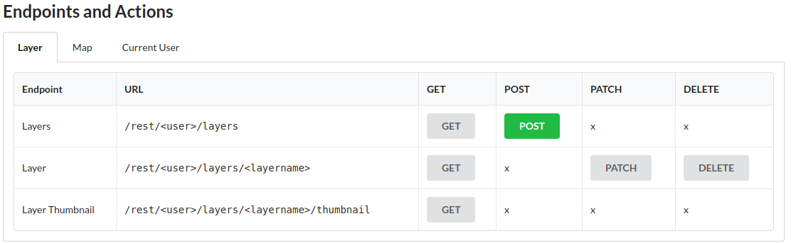
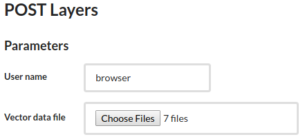
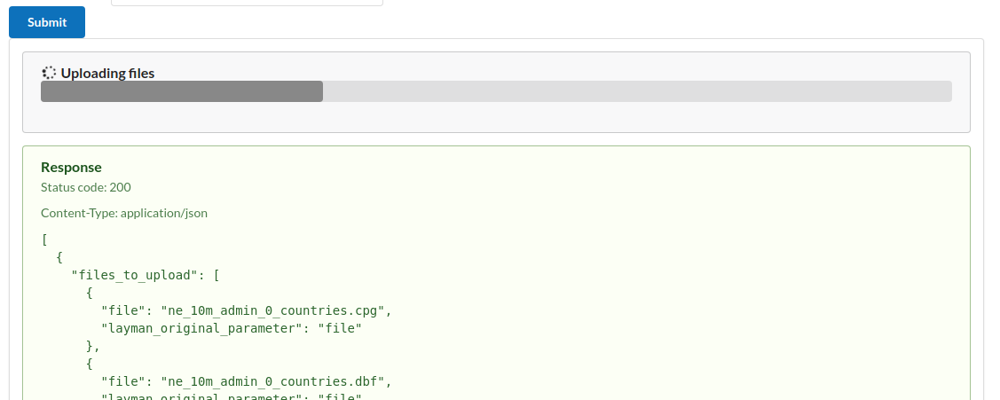
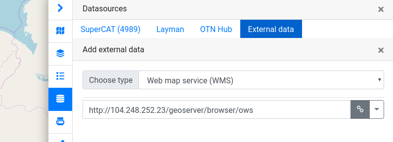
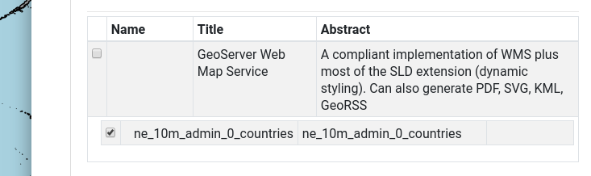
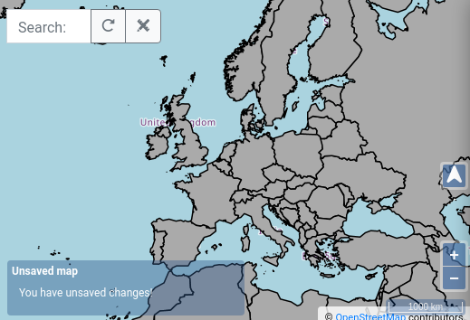

## Layman's REST API

### Jiří Kozel

Workshop 4

<small>Big and Open Data and Innovative Hubs in Agriculture, Transport and Rural Development
<br/>
<br/>
Czech University of Life Sciences, Prague
<br/>
<br/>
January 29, 2020
</small>

---
## Workshop 4
<ul style="font-size: 80%">
<li>Karel Charvát - Purpose of workshop</li>
<li>Jiří Kozel - What is Layman and how it works</li>
<li>Raitis Berzins - Map composition</li>
<li>Jiří Kozel, Jiří Kvapil - How to install Layman in cloud</li>
<li style="color: orange">Jiří Kozel - Layman API</li>
<li>Jiří Kozel - Authentication and authorization</li>
<li>Jiří Kozel - Interaction with Metadata (Micka)</li>
<li>Jan Vrobel - QGIS plugins for accessing maps and map composition from server</li>
<li>Jan Vrobel - QGIS plugin for Web data publishing using Layman</li>
<li>Raitis Berzins - HSLayers NG as client for Layman</li>
</ul>

---
## WARNING!
### This part is also <span style="color: orange;">technical</span>!

---
## What is REST?
**Representational state transfer**
- is a software architectural style
- that allows requesting systems to access and manipulate web resources
- by using a uniform and predefined set of stateless operations.

<!--v-->
## What is REST?
In case of Layman
- **web resources** are **layers** and **maps**
- **operations** are standard HTTP methods
   - GET, POST, PATCH, and DELETE

---
## Layman REST API Operations
|HTTP&nbsp;method|type of operation|
|---|---|
|POST|publish new resource|
|GET|get information about existing resource|
|PATCH|edit existing resource|
|DELETE|delete existing resource|

---
## Layman REST API Resources
- **Layer**
  - `/rest/<username>/layers`
  - `/rest/<username>/layers/<layername>`
- **Map**
  - `/rest/<username>/maps`
  - `/rest/<username>/maps/<mapname>`

<!--v-->
## Layman REST API Resources
- `username`
  - unique identification of user (owner of resources) within Layman
  - depending on configuration, user's identity is either checked by OAuth2 provider, or it is not checked at all
    - user's identity is not checked in default demo configuration
  - it can not be changed

<!--v-->
## Layman REST API Resources
- `layername`, `mapname`
  - unique identification of layer (map) within all layers (maps) of given user
  - it is chosen or automatically generated when the layer is published
  - it can not be changed

---
## Publish new Layer
1. Download some NaturalEarth data
  - [Countries 1:10M](https://www.naturalearthdata.com/http//www.naturalearthdata.com/download/10m/cultural/ne_10m_admin_0_countries.zip)
1. Unzip it
1. Visit <span style="color: orange;">http://&lt;your IP address&gt;/</span> in your web browser

<!--v-->
## Publish new Layer
4. Choose resource **Layer**, endpoint **Layers**, method **POST**



<!--v-->
## Publish new Layer
5. Choose all seven <strong>ne_10m_admin_0_countries.*</strong> files at **Vector data file** field


5. Click **Submit**

<!--v-->
## Publish new Layer
7. Wait till uploading is finished


<!--v-->
## Publish new Layer
8. In the meantime you can check the response

```json
[
  {
    "files_to_upload": [
      {
        "file": "ne_10m_admin_0_countries.cpg",
        "layman_original_parameter": "file"
      },
      ...
    ],
    "name": "ne_10m_admin_0_countries",
    "url": "/rest/browser/layers/ne_10m_admin_0_countries",
    "uuid": "a8c6f6f4-1254-49fd-8223-5ed8f4fa185f"
  }
]
```

---
## Get list of all Layers
1. Choose resource **Layer**, endpoint **Layers**, method **GET**
1. Click **Submit**

```json
[
  {
    "name": "ne_10m_admin_0_countries",
    "url": "/rest/browser/layers/ne_10m_admin_0_countries",
    "uuid": "a8c6f6f4-1254-49fd-8223-5ed8f4fa185f"
  }
]
```

---
## Get information about single Layer
1. Choose resource **Layer**, endpoint **Layer**, method **GET**
1. Enter name of the layer to **Layer name** field
  - `ne_10m_admin_0_countries`
1. Click **Submit**

<!--v-->
## Get information about single Layer

```json
{
  ...
  "metadata": {
    "csw_url": "http://micka:80/csw",
    "record_url": "http://104.248.252.23:3080/record/basic/m-a8c6f6f4-1254-49fd-8223-5ed8f4fa185f"
  },
  "name": "ne_10m_admin_0_countries",
  ...
  "wfs": {
    "url": "http://localhost:8600/geoserver/browser/ows"
  },
  "wms": {
    "url": "http://localhost:8600/geoserver/browser/ows"
  }
}
```

---
## Set correct Proxy Base URL of GeoServer
1. Visit <span style="color: orange;">http://&lt;your IP address&gt;/geoserver</span> in your web browser
1. Login using username **admin**, password **geoserver**
1. In left menu, click on **Global** under **Settings**
1. Set **Proxy Base URL** to <span style="color: orange;">http://&lt;your&nbsp;IP&nbsp;address&gt;/geoserver/</span>
1. Scroll down and click **Submit**

---
## Get information about single Layer again
1. Choose resource **Layer**, endpoint **Layer**, method **GET**
1. Enter name of the layer to **Layer name** field
  - `ne_10m_admin_0_countries`
1. Click **Submit**

<!--v-->
## Get information about single Layer again

```json
{
  ...
  "metadata": {
    "csw_url": "http://micka:80/csw",
    "record_url": "http://104.248.252.23:3080/record/basic/m-a8c6f6f4-1254-49fd-8223-5ed8f4fa185f"
  },
  "name": "ne_10m_admin_0_countries",
  ...
  "wfs": {
    "url": "http://104.248.252.23/geoserver/browser/ows"
  },
  "wms": {
    "url": "http://104.248.252.23/geoserver/browser/ows"
  }
}
```

---
## View Layers in map
1. Visit [https://ng.hslayers.org/examples/datasources/?hs_panel=datasource_selector](https://ng.hslayers.org/examples/datasources/?hs_panel=datasource_selector)
1. Set
  - **Choose type**: <span style="color: orange;">Web map service (URL)</span>
  - **External data source (URL)**: <span style="color: orange;">http://&lt;your&nbsp;IP&nbsp;address&gt;/geoserver/browser/ows</span>
1. Click on gray chain icon at bottom right

<!--v-->
## View Layers in map


<!--v-->
## View Layers in map
4. Check layers you want to see

4. Click on blue plus icon at bottom right

<!--v-->
## View Layers in map
7. Browse the map



