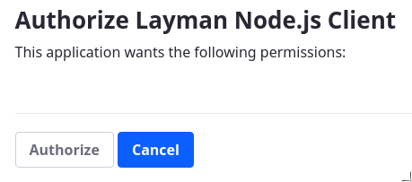
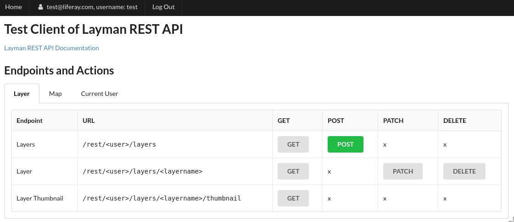

## Authentication and Authorization

### Jiří Kozel

Workshop 4

<small>Big and Open Data and Innovative Hubs in Agriculture, Transport and Rural Development
<br/>
<br/>
Czech University of Life Sciences, Prague
<br/>
<br/>
January 29, 2020
</small>

---
## Workshop 4
[https://github.com/jirik/layman-workshop](https://github.com/jirik/layman-workshop)

<ul style="font-size: 80%">
<li>Karel Charvát - Purpose of workshop</li>
<li>Jiří Kozel - What is Layman and how it works</li>
<li>Raitis Berzins - Map composition</li>
<li>Jiří Kozel, Jiří Kvapil - How to install Layman in cloud</li>
<li>Jiří Kozel - Layman API</li>
<li style="color: orange">Jiří Kozel - Authentication and authorization</li>
<li>Jiří Kozel - Interaction with Metadata (Micka)</li>
<li>Jan Vrobel - QGIS plugins for accessing maps and map composition from server</li>
<li>Jan Vrobel - QGIS plugin for Web data publishing using Layman</li>
<li>Raitis Berzins - HSLayers NG as client for Layman</li>
</ul>

---
## WARNING!
### This part is also <span style="color: orange;">technical</span>!

---
## Authentication
- process of obtaining and ensuring identity of user from incoming request to REST API
- performed by chain of zero or more authentication modules
- if no module succeeds, user is considered **anonymous**

<!--v-->
## Authentication
Two basic options
- use **no authentication module**, so every user is considered as anonymous
  - default
- **OAuth2** module with Liferay as authorization server
  - [detailed documentation](https://github.com/jirik/layman/blob/master/doc/oauth2/index.md)

---
## Authorization
- process that decides if authenticated user has permissions to perform the request to REST API
- performed by single authorization module
- if the user does not have enough permissions, an "Unauthorised access" exception is raised

<!--v-->
## Authorization
|Types of operations| corresponding HTTP method|
|---|---|
|**read**|GET|
|**write**|POST, PUT, PATCH, DELETE|

<!--v-->
## Authorization
Two basic options
- **read everyone, write everyone**
  - everyone including anonymous user is able to read and write to anybody`s workspace
  - default
- **read everyone, write owner**
  - everyone including anonymous user is able to read anybody`s workspace, but only user that owns the workspace is able to write

---
## Check current user
1. Visit <span style="color: orange;">http://&lt;your IP address&gt;/</span> in your web browser
1. Choose **Current User**, endpoint **Current User**, method **GET**
1. Click **Submit**

<!--v-->
## Check current user
```json
{
  "authenticated": false,
  "claims": {
    "iss": "http://layman:8000/",
    "name": "Anonymous",
    "nickname": "Anonymous"
  }
}
```

---
## Materials
[https://github.com/jirik/layman-workshop](https://github.com/jirik/layman-workshop)

---
## Log In
1. Visit <span style="color: orange;">http://&lt;your IP address&gt;/</span> in your web browser
1. Click **Log In**
  - you are forwarded to different domain where Liferay is running

<!--v-->
## Log In
2. Set
  - Email Address: test@liferay.com
  - Password: test
  - Remember Me: checked
2. Click **Sign In**

<!--v-->
## Log In
5. Click **Authorize**



<!--v-->
## Log In


---
## Check current user again
1. Choose **Current User**, endpoint **Current User**, method **GET**
1. Click **Submit**

<!--v-->
## Check current user again
```json
{
  "authenticated": true,
  "claims": {
    "email": "test@liferay.com",
    "email_verified": true,
    "family_name": "Test",
    "given_name": "Test",
    "iss": "http://167.172.174.152:8082/o/oauth2/authorize",
    "middle_name": "",
    "name": "Test Test",
    "preferred_username": "test",
    "sub": "20139",
    "updated_at": 1580279122416
  },
  "username": "test"
}
```
