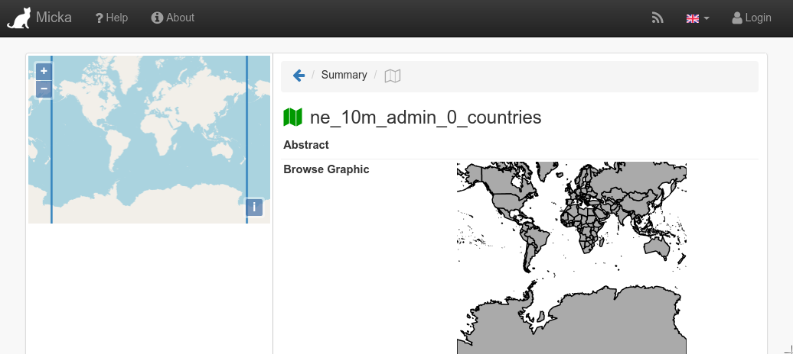

## Interaction with Metadata (Micka)

### Jiří Kozel

Workshop 4

<small>Big and Open Data and Innovative Hubs in Agriculture, Transport and Rural Development
<br/>
<br/>
Czech University of Life Sciences, Prague
<br/>
<br/>
January 29, 2020
</small>

---
## Workshop 4
[https://github.com/jirik/layman-workshop](https://github.com/jirik/layman-workshop)

<ul style="font-size: 80%">
<li>Karel Charvát - Purpose of workshop</li>
<li>Jiří Kozel - What is Layman and how it works</li>
<li>Raitis Berzins - Map composition</li>
<li>Jiří Kozel, Jiří Kvapil - How to install Layman in cloud</li>
<li>Jiří Kozel - Layman API</li>
<li>Jiří Kozel - Authentication and authorization</li>
<li style="color: orange">Jiří Kozel - Interaction with Metadata (Micka)</li>
<li>Jan Vrobel - QGIS plugins for accessing maps and map composition from server</li>
<li>Jan Vrobel - QGIS plugin for Web data publishing using Layman</li>
<li>Raitis Berzins - HSLayers NG as client for Layman</li>
</ul>

---
## WARNING!
### This part is also little bit <span style="color: orange;">technical</span>!

---
## Metadata
- Layman is able to publish **partial metadata** records to OGC Catalogue Service Micka
- Records are partial because Layman does not know all metadata properties
- currently, only **Layer** metadata are published, and only on POST request
  - full support in May 2020

---
## Get information about single Layer
1. Choose resource **Layer**, endpoint **Layer**, method **GET**
1. Enter name of the layer to **Layer name** field
  - `ne_10m_admin_0_countries`
1. Click **Submit**

<!--v-->
## Get information about single Layer

```json
{
  ...
  "metadata": {
    "csw_url": "http://micka:80/csw",
    "record_url": "http://104.248.252.23:3080/record/basic/m-a8c6f6f4-1254-49fd-8223-5ed8f4fa185f"
  },
  "name": "ne_10m_admin_0_countries",
  ...
}
```

---
## Show metadata record
1. Copy `metadata.record_url` value and open this address in the browser



---
## Edit metadata record in Micka
5. Login using name **editor**, password **editor**
5. Edit metadata record.
